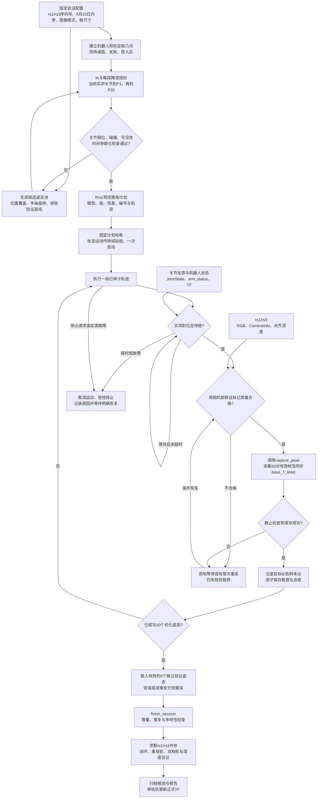

# Piper 双相机自动标定：20 姿态、RViz 预览与自动采集

日期：2026-09-11。目标是在固定安装条件下，完成一次轨迹审阅和启动后，
机械臂依次到达 20 个优化姿态，每次停稳后同时采集 rs1、rs3，自动生成外参和验证报告。
本次交付了可运行的 **20 姿态离线预览**，并完成下面的自动运动/采集设计。
**自动真机执行调度器及其现场运动验收尚未实现，本文件不表示真机已经跑通。**

## 1. 本次交付与代码现状

**当前点位来源已改为操作者手动示教。用户否决了首轮历史拼接的全部20个候选，
下文旧预览只保留为实现与诊断记录，不再作为推荐点位方案。**
不再自动生成替代点；读取示教反馈，由操作者逐点确认后记录。

| 部分 | 实现/文件 | 当前状态 |
|---|---|---|
| 从历史机器人姿态筛选 20 个候选 | `tools/build_calibration_preview.py` | 已实现、已生成本次候选 |
| 当前 URDF 下的 IK、FK、关节限位与姿态重复检查 | `rekpiper_planning/piper_urdf_ik.py`；`rekpiper_calibration/trajectory_preview.py` | 已通过；不包含碰撞检查 |
| 虚拟 Piper、编号、link6 连接轨迹 | `calibration_preview.launch`、`calibration_preview_node.py`、`calibration_preview.rviz` | 已实现；隔离 ROS 中验证显示数据 |
| 两相机同步、50 帧采集、静止检查、逐姿态保存 | `dual_aruco18_capture_node.py` | 已存在并用于之前 6 个姿态 |
| 20 个成功样本的到位、采集、失败恢复调度 | 拟新增 `automatic_calibration_node.py` | 待实现；当前不存在此可执行文件 |
| 标定专用碰撞场景和运动后端 | 拟新增 calibration 作用域的运动验收与 action | 待实现和现场验收 |
| 外参求解、独立验证和候选输出 | `solve_dual_aruco18_dataset.py`、`eye_to_hand.py` | 已存在；待新数据运行 |

本工程已安装 RViz 和 `moveit_ros_move_group`，但没有项目专用的 MoveIt 配置、SRDF
及标定场景。安装了 MoveIt 不等于已经有 Piper 的避碰运动系统。

## 2. 按依赖顺序实施

### A. 固定本次会话的设备与几何口径

- rs1 序列号 `346522071783`；rs3 序列号 `934222070377`。
- RGB 为 640×360；标记为 DICT_4X4_50、ID18、黑色方形外边长 100 mm。
- 标记原点是 **ArUco 黑色方形中心**，不一定是整个承载板的几何中心。
- 机器人使用 `base_link → link6`；现有文件 `arm_base/tool` 的映射依据见 `M1_PROGRESS.md`。
- 按用户本轮口径，以 9 月 10 日的文件内参作为彩色 PnP 主计算候选，保留原文件路径和哈希。
  当前采集节点实际读取驱动 CameraInfo，不能声称配置已切换：自动采集实现前需明确保存
  `color_pose_intrinsics` 与 `depth_projection_intrinsics` 两套来源。原图用 K、D；若改用去畸变图，
  必须同时使用对应的新 K 和零畸变，不能再次用原 D。
- 对齐深度由驱动模型生成，不能仅覆盖 CameraInfo 就假定新的彩色内参与对齐深度几何一致。
  保留原始像素/深度及模型身份，先用已知标记尺寸检查配准和米制误差，再确定投影处理。
  两个 CameraInfo 口径下的差异只能说明链路不一致，不能单独证明哪套内参物理上更准确。
- 给 URDF 增加实际标定板和支架的附着碰撞几何。需要测量整个外轮廓、厚度、安装偏移；
  100 mm 标记边长不代表支架尺寸。两份 `link6_T_marker` 平移均值只可作候选位置先验。
- 测量桌面在 base 下的位置、相机支架和禁入区，建立独立的固定标定场景。

输出：会话配置、内参/URDF/场景哈希、序列号、图像模式、标记与支架几何。
下一步的规划、采集与求解必须引用同一份配置；发生变更则使旧计划失效。

### B. 生成候选姿态、规划每一段连接路径

正式目标为 **20 个成功的 optimization poses + 至少 6 个独立 validation poses**。
当前求解器最少要求 18+6，因此不能把总共 20 个拆为 14+6 后直接使用。

首次候选可由多个可见位置与绕不同轴的旋转组合产生；例如 5 个位置各 4 个姿态。
具体位移和角度由视野、IK、碰撞场景决定，不预先承诺某个固定 5 cm/20° 偏移可执行。
避免仅绕同一轴旋转；除现有位置跨度检查外，正式候选选择应检查旋转轴激励和求解条件数。

本次预览从 9 月 10 日两份历史标定记录的 `base_to_tool_matrix_4x4` 读取机器人目标，
用当前 URDF、多组实测关节种子求 IK，只选满足 0.1 mm/0.001 rad 数值残差且不近似重复的候选。
与已有验证姿态同时接近 10 mm 和 5° 的候选也被排除。
六个验证姿态仅提供 IK 初值和防重复检查，未用于重新拟合外参。
旧相机观测不被当成这次的新优化样本。

当前 20 候选跨度约 401/332/269 mm、最大姿态跨度约 143°。
**范围较大，尚未证明两相机同时可见，也没有做路径碰撞检查。**
实际部署须从候选中筛选并补齐 20 个可见、安全姿态；不能直接执行本次预览文件。

正式规划需要逐段处理 `当前实测关节 → P1 → P2 → … → P20`，包括第一段。
检查机器人自碰撞、桌面/支架碰撞、标定板扫掠、关节限位、奇异位形、相邻关节跳变和净空。
将速度、加速度及控制器支持的插值方式纳入时间参数化，审计与发送使用同一离散轨迹。
相机候选外参只用于预测可见性，不作为未经验证的障碍物位置真值。

输出：20 个关节目标、每段 `JointTrajectory`、关节/碰撞/可见性报告、轨迹哈希。

### C. RViz 审阅

本次预览具备：半透明机器人模型、20 个姿态编号、link6 的实际 FK 插值曲线、依次动画。
每段动画为 4 秒五次多项式插值，每个目标停留 1 秒，约 96 秒播放完并停在末姿态。
这只是播放速度，不是已验收的真机速度。预览直接从 P1 开始，没有伪造当前真机到 P1 的连接。
当前夹爪显示为闭合；实体标定板/支架尚未建模。

规划完善后，RViz 应再显示：桌面与禁入区、标定板附着体、相机视锥、计划/实测轨迹区别，
以及每个点的可见性与采集进度。RViz 负责展示；运动规划和控制分别由规划器、后端执行。

### D. 启动一次，自动完成每个姿态的停稳与采集

拟新增的调度器每次只提交一段运动，避免预先排队多段无法及时中止：

1. 验证计划哈希、当前关节反馈、控制模式及现场运动许可。
2. 执行当前段，检查 action 状态与新鲜的实际关节反馈。
3. 检查已到目标，例如初始调试可用最大关节差 0.01 rad；这是待现场确认的到位阈值，
   不能替代下面采集窗口的更严格静止检查。
4. 连续静止约 1 秒且两相机 `READY_TO_CAPTURE` 后，调用采集服务。
5. 采满 50 对有效 RGB-D 帧，采集节点检查 TF 平移跨度 ≤2 mm、旋转跨度 ≤0.20°、
   六轴关节跨度 ≤0.002 rad，才可接受。每路标记最短边 ≥30 px、距边缘 ≥30 px；
   深度平面需要至少 12 个有效网格点，并满足帧占比与平面拟合检查。
6. 服务成功且 dataset 中出现唯一的新样本后，记录 `plan_pose_id → dataset_sample_id`，再进入下一段。

不得用固定 sleep、action 返回成功或发完关节命令替代真实到位/静止判定。
标记丢失或深度不足：停在当前点，有限次数重采；仍不合格则进入暂停，或选择预先审计过的备用姿态。
拒绝的姿态不计入 20 个成功样本；不临时猜测一条新运动路径。
反馈过期、控制器故障、越界或停止请求：中止序列，取消当前运动并通过运动后端请求受控停止，
记录实测停止结果；不得自动复位、重新使能或跳到下一点。

暂停/重启后先读取 dataset 和运行日志，防止“采集成功但服务回执丢失”造成重复采集；
重新规划当前位置到下一目标的连接。暂停不等于断使能，停止服务也不等于实体急停。
通信断开时不能仅依靠同一通信链路的停止请求，需要现场验证独立停机手段。

### E. 验证、求解与归档

当前 6 个验证姿态可在相机、机器人基座和板到 link6 的安装未变，且图像模型一致时继续使用。
复制到新会话后保留原始来源与哈希；不直接修改封存文件。若安装或成像模式变化，应自动重采独立验证集。

采满 20 个优化姿态和 6 个验证姿态后调用 `finish_session`。
通过数量及多样性检查后，使用 `solve_dual_aruco18_dataset.py` 计算：

- 每台相机的 `base_T_optical`、`base_T_link` 和 `link6_T_marker`；
- 独立验证的重投影误差、基座坐标系闭环误差、双相机差异和深度平面一致性；
- 新旧外参在同一验证集、同一内参口径下的对比。

求解器不会自动批准 TF。现有正式阈值仍是重投影 ≤0.8 px、双相机中位数 ≤5 mm、P95 ≤8 mm。
若后续为特定抓取任务采用厘米级要求，应另建任务验收标准并验证实际抓取成功率，不能静默修改标定门槛。
日志、原始数据、计划、模型/文件哈希、拒绝原因与报告一起归档，候选通过审核后才更新正式 TF。

## 3. 已有接口与待新增接口

| 方向 | 接口 | 传输信息/成功依据 |
|---|---|---|
| Piper → 调度器/采集器 | `/joint_states_single`，`sensor_msgs/JointState` | joint1..6 的 rad 值、消息时间戳；使用实测而非指令值 |
| Piper → 运动后端 | `/arm_status`，`PiperStatusMsg` | 模式、故障、限位与通信状态；校验新鲜度 |
| robot_state_publisher → 采集器 | `/tf` | 同步时刻 `base_link → link6` |
| rs1/rs3 → 采集器 | `/rs*/color/image_raw`、`color/camera_info`、`aligned_depth_to_color/image_raw` | RGB、在线 K/D、对齐深度与各自时间戳/坐标系 |
| 采集器 → 调度器 | `/dual_aruco18_capture/status`，`std_msgs/String` JSON | state、quality、计数；还须检查消息到达时间以防 latch 旧状态 |
| 调度器 → 采集器 | `/dual_aruco18_capture/capture_pose`，`std_srvs/Trigger` | 采集 optimization；成功响应含样本 ID 和 dataset 路径 |
| 调度器 → 采集器 | `/dual_aruco18_capture/capture_validation_pose`，Trigger | 采集独立 validation |
| 调度器 → 采集器 | `/dual_aruco18_capture/finish_session`，Trigger | 达到数量/多样性后完成数据集 |
| 调度器 → 标定运动后端（拟建） | `/calibration_motion/follow_joint_trajectory`，`FollowJointTrajectoryAction` | 仅接受会话已审计的当前一段、持续反馈、取消与错误结果 |
| 用户 → 调度器（拟建） | start / pause / resume / stop | 控制整个序列；resume 重新核对状态，不隐式使能 |
| 调度器 → 运行日志（拟建） | 逐事件 JSONL + 原子更新状态文件 | session、计划哈希、目标/样本 ID、实际反馈、重试与停止原因 |

服务名以源码为准：优化采集实际为 **`capture_pose`**，不是 `capture_optimization_pose`。
采集器继续只负责读数据和保存，运动由另一个有验收约束的组件承担。

## 4. 标定专用运动后端为什么需要新增

`piper_trajectory_bridge_node.py::_health()` 要求已通过精度验收的相机外参与 READY 安全地图，
用于正式抓取流程。`piper_ctrl_single_node.py` 在打开 CAN 前还验证完整签名 release。
因此仅新建 action 名称或设置 `allow_hardware_commands=true` 都不能提供可用的首次标定入口。

标定后端必须有独立的、受限的验收作用域：限定机器人身份、URDF、桌面/障碍物、附着标定板、
允许的关节路径、速度与停止条件，将这份证据绑定到当前会话。
通过这条受限路径完成首次标定；正式抓取桥及其 `UNCALIBRATED`、签名和地图门保持原语义。
这需要在 acceptance 与 Piper 驱动入口中显式实现并测试，不能用空地图或伪造通过状态绕过。

当前只读 Piper 节点会因 CAN TX 增加而退出，故自动运动阶段需切换为经过验收的控制后端来提供反馈，
不能与只读 launch 混用，也不能靠关闭 `fail_on_can_tx` 把它变成运动驱动。
M1.5 的现场边界与停机条件仍待完成；这是自动真机标定的实际前置条件。

## 5. 工作流



## 6. 现在可以运行的预览

预览文件在 runtime/evidence 内，不作为正式配置或可执行轨迹。
只需启动下面入口即可看到模型与轨迹，不需要启动 CAN、相机或 MoveIt。
独立使用 11319 端口，避免与现有采集 master 混淆；关闭时在此终端按 Ctrl+C。

```bash
cd /home/zhengsihze/Rekep_v1.0-main
source setup.bash
export ROS_HOME=/tmp/rekpiper_calibration_preview_ros
export ROS_MASTER_URI=http://127.0.0.1:11319
roslaunch -p 11319 rekpiper_calibration calibration_preview.launch \
  plan:=/home/zhengsihze/Rekep_v1.0-main/runtime/evidence/m2_20260911_base_frame_validation/calibration_20_pose_preview.yaml
```

预览模型使用 `/calibration_preview/robot_description`，所有虚拟 TF 均在
`/calibration_preview/tf` 和 `/calibration_preview/tf_static`；显示关节和路径在
`/calibration_preview/playback/*`。不会发布 `/joint_ctrl_single`、`/joint_states_single` 或全局 `/tf`。

重新生成另一份候选（输出文件必须不存在，防止覆盖证据）：

```bash
python tools/build_calibration_preview.py \
  --source runtime/evidence/m2_20260911_base_frame_validation/raw_sources/20260910T100042Z_346522071783.yaml \
  --source runtime/evidence/m2_20260911_base_frame_validation/raw_sources/20260910T123031Z_934222070377.yaml \
  --validation-dataset runtime/evidence/m2_20260911_base_frame_validation/external_candidate_validation_dataset.yaml \
  --output /tmp/calibration_20_pose_preview.yaml
```

## 7. 本次验证与下一步

- 仓库审计与 launch 路径/Shadow 参数展开通过。
- Catkin 构建通过；测试汇总 219 tests，0 errors、0 failures、0 skipped。
- 新增测试覆盖非法数值/关节越界、重复候选、FK 不一致、硬件标志拒绝，以及 TF 话题隔离。
- 隔离 ROS 实测收到 20 个编号 + 1 条包含 1920 个点的轨迹，虚拟 joint1..8 和私有 TF；
  状态到达 `PREVIEW_COMPLETE` 后正常关闭测试会话，未出现驱动或控制命令话题。
  GUI 画面和实体避碰不包含在该验证结论中。运行证据见
  `runtime/evidence/m2_20260911_base_frame_validation/calibration_preview_smoke_report.json`，
  新增预览证据的校验清单为同目录的 `calibration_preview_SHA256SUMS`。

下一步先补齐标定板/支架尺寸、桌面高度和障碍物位置，缩小并审计候选工作区；
随后实现固定场景规划与标定运动验收，接上到位采集调度器。
正式运行前先做无硬件状态机故障测试，再做单段到位采集，最后一次运行20姿态。

## 8. 本轮现场补充：工作区、板尺寸与旧标定的选用

用户提供桌面约在 base 原点下方 7 mm，活动范围为前方 70 cm、左右各 40 cm、
高度 5–60 cm。本轮按前方为 +X、左右为 ±Y、向上为 +Z 解释，记录为
`X=[0,0.70]、Y=[-0.40,0.40]、Z=[0.05,0.60] m`；物理轴向仍需与现场核对。
该范围用于末端、标记和整板的诊断，不把固定基座本体要求在 Z≥5 cm，也不等于无障碍空间。

已查看之前两台相机的姿态1/6图像；图中有方块、黄色圆盘和线缆。
用户说明将在自动标定前移走，当前状态记录为计划清场，未宣称已实测清空。

用户尺寸与图纸：整板宽120 mm、高150 mm、厚3 mm；标记100 mm，上边距10 mm、
下边距40 mm；两安装孔直径3.2 mm、间距45 mm，孔中心在板底边上方20 mm。
以图纸方向对应 marker 的 X向右、Y向上、Z朝印刷面外，板体中心为
`marker_T_board.translation=[0,-0.015,-0.0015] m`，不能把板中心放在标记中心。
孔只用于定位说明；碰撞外形按完整实心长方体表示，未挖去小孔。

用户最后明确“按照旧标定来”：rs1、rs3 的相机外参仍各自保留原值；
共用板模型采用两份旧 `tool_to_target_mean` 的平均刚体变换，平移为
`[-0.161043385,0.017055036,0.042288622] m`，平均旋转使用四元数平均。
用户此前的120 mm最远端估计不再用于拟合或缩放该变换。
它与旧结果的差异被保留为记录：旧平均变换下到标记中心167.37 mm，到整板最远角238.10 mm。
此次选择是几何建模依据，不改变外参候选的验收状态或自动运动权限。

按这个候选模型检查了20个目标、1920个动画轨迹采样状态，包括link6原点、TCP、
标记中心/四角及整板八个角。采样点的联合范围如下：

| 轴 | 最小值 | 最大值 | 用户范围 |
|---|---:|---:|---|
| X | 2.30 cm | 64.55 cm | 0–70 cm |
| Y | -31.43 cm | 29.86 cm | -40–40 cm |
| Z | 8.82 cm | 56.28 cm | 5–60 cm |

全部采样点在边界内；距离高度下限约3.82 cm、上限约3.72 cm。
这是候选板安装变换下的离散几何范围检查，未验证支架外形、整臂/自碰撞、障碍物、
连续扫掠、双相机可见性、当前实机到P1的连接和控制器运动。
这些范围不能作为实际物体或实际机器人误差的保证。

本轮新增：

- `tools/audit_calibration_workspace.py`：记录目标与路径点范围、余量、越界编号和未检查项。
- `workspace_bounds.py`：板角点与范围检查；测试覆盖板中心在界内但角点越界、板中心偏移和非法数据。
- RViz 支持工作区半透明盒、采用旧标定的整板模型，以及跟随机械臂的link6三色坐标轴。

更新后的预览命令：

```bash
cd /home/zhengsihze/Rekep_v1.0-main
source setup.bash
export ROS_HOME=/tmp/rekpiper_calibration_preview_ros
export ROS_MASTER_URI=http://127.0.0.1:11319
preview_evidence="$PWD/runtime/evidence/m2_20260911_base_frame_validation"
roslaunch -p 11319 rekpiper_calibration calibration_preview.launch \
  plan:="$preview_evidence/calibration_20_pose_preview.yaml" \
  workspace:="$preview_evidence/site_workspace_old_calibration_selected_20260911.yaml" \
  geometry_report:="$preview_evidence/calibration_workspace_old_selected_audit_20260911.yaml"
```

旧预览文件保持不变；用户选用旧标定后的新工作区和新报告单独保存。
板显示读取与计划/工作区哈希匹配的报告，不在显示节点中重新拟合安装变换。

本轮构建、仓库/launch审计通过，测试汇总223 tests、0 errors、0 failures、0 skipped。
隔离ROS验证收到26个显示对象（工作区、整板、三根link6坐标轴、路径和20个编号），
整板尺寸与坐标系匹配；报告为同证据目录的`calibration_workspace_display_smoke_20260911.json`。
验证只覆盖发布的显示数据，未进行GUI画面验收或真机运动。

## 9. 当前流程：操作者示教提供点位

用户要求先由自己提供点位。当前只读ROS链路已实测：`ctrl_mode=2`（TEACHING_MODE）、
`arm_status=0`、错误码0；关节消息与同步 `base_link → link6` 可用，检查期间CAN TX为0。
该预检只验证链路，不登记当前姿态为第一个正式点。

每次操作者摆好并发送“点位N已就绪”后，读取并保存实测六轴关节、同刻FK、
状态、时间戳与双相机质量信息。采样点要求两相机看见ID18并通过静止/采集质量检查；
仅为连接运动使用的点单列为过渡点，不计入20个优化样本。
待操作者点位准备好后按其顺序构建新的RViz方案，并单独检查段间连接路径。

当前示教会话位置由
`runtime/evidence/m2_20260911_base_frame_validation/manual_teaching_active_session.json`
记录。旧20点、旧外参和6个验证样本均保留，点位文件继续禁止硬件执行。

### 固定的快速记录流程

常驻 `manual_teaching_recorder_node.py` 保存最近约1秒的六轴反馈、控制器状态、
双相机就绪状态和检测图像；只在明确调用记录服务时写入新点。
摆好后保持约1秒，两相机均显示READY，再说“记录”或调用以下服务：

```bash
cd /home/zhengsihze/Rekep_v1.0-main
source setup.bash
export ROS_MASTER_URI=http://127.0.0.1:11311
rosservice call /manual_teaching_recorder/record "{}"
```

仅检查、不给点编号：

```bash
rosservice call /manual_teaching_recorder/check "{}"
```

记录器启动命令（节点已在线时无需重复启动）：

```bash
export ROS_HOME=/tmp/rekpiper_recorder_ros
roslaunch rekpiper_calibration manual_teaching_recorder.launch \
  waypoints:=/home/zhengsihze/Rekep_v1.0-main/runtime/evidence/m2_20260911_base_frame_validation/manual_teaching/20260911T041336Z/waypoints.yaml
```

检查保留原静止要求（最大关节跨度0.002 rad），至少50条、覆盖至少0.9秒的连续反馈，
关节/机器人状态新鲜度0.25秒、双相机状态和图像0.30秒；窗口中两相机必须持续READY，
且控制器处于正常示教模式。使用代表性实测关节与同刻TF保存，核对FK一致性和CAN TX计数。
同任何已有点同时接近10 mm和5°时拒绝重复登记；失败不增加编号。

保存内容固定为角度/rad、XYZ/RPY/四元数/完整矩阵、同步时间戳、原始窗口、两相机质量、
两张PNG、校验值和旧点位文件备份。此记录仍不是50帧正式RGB-D标定样本。
前台默认简短报告点位编号、六轴角度、XYZ和两相机通过情况；异常时补充原因。

临时会话实测：检查约0.007秒、一次完整保存约0.095秒；重复记录被拒绝，正式前两个点未修改。
这是本机服务处理时间，不含对话、工具调度与网络延迟。全工程227 tests，0 errors、0 failures、0 skipped。

### 12个实测点排序、插值到20点（2026-09-11）

用户随后授权用当前12点生成新预览，并确认：沿伸出方向看，+Y为左、−Y为右；
以link6原点高度每层最低点为锚点，20 mm内归同层，各层从下到上、层内从左到右。
原始编号分层为 `1→2→3→4`、`7→6→12→11→5`、`9→8→10`。
新增 `tools/build_teaching_preview.py` 保留12个实测关节姿态，按最大单关节变化优先
细分相邻段，插入8个候选点，再复用五次关节插值播放；层内高度不要求严格递增。

新文件位于 `runtime/evidence/m2_20260911_base_frame_validation/taught12_preview_20260911/`：
`plan.yaml`、原始快照、`points.csv`、轨迹PNG/SVG、`workspace_audit.yaml` 和含启动命令的
`README.md`。RViz编号 `12:T12` 表示预览第12点来源实测T12，`11:I` 表示插值候选。
预览独立使用11319及私有TF，原记录器继续使用11311；正式示教记录仍为12条。

1920个路径采样状态通过关节限位检查，旧标定几何下末端/整板角点均在用户工作区内。
原T12关节5距上限仅约0.162°。插值候选的双相机可见性、整臂/支架碰撞、实机到首点连接、
控制器时序及现场执行尚未验证；20个预览点不等于已采集20个标定样本，禁止硬件执行。

用户进一步澄清70指末端高度上限70 cm，不是关节5的角度要求。当前以link6原点定义
末端，单独检查base_link下Z≤0.70 m；1920个采样状态高度19.782–26.114 cm，全部通过，
证据为同目录 `endpoint_height_check.json`。URDF关节限位独立保留，不按该高度数值修改。
