# ReKep → Piper：目标分解与数据流验收基线

审阅日期：2026-09-10。工程根目录：`/home/zhengsihze/Rekep_v1.0-main`。

本文初始把后续部署、测试和现场验收全部设置为**未完成**，随后按逐项目标的证据更新勾选状态。文中的源码定位只表示已有实现可供检查，不表示模型已能运行、ROS 已接通或真机已验收。初始流程梳理没有启动相机、机械臂或 VLM 请求。

相机命名按用户要求采用 **rs1 + rs3**。rs3 绑定序列号为 **934222070377**，是另一台设备。M0.4 已完成生产源码、launch、消息与配置迁移，并保留 rs2 历史标定；rs3 使用自己的未标定占位配置。真实 RGB-D 接入及物理标定仍由 M2 验收。

现有 rs3 证据位于标定工作区：

- [独立启动文件](/home/zhengsihze/Eye_To_Hand_ws/src/piper_eye_to_hand_calibration/launch/calibrate_rs3_standalone.launch)：绑定 `934222070377`，彩色流为 640×360@30 Hz；深度与对齐关闭，不能直接充当本工程 RGB-D 入口。
- [rs3 内参](/home/zhengsihze/Eye_To_Hand_ws/src/piper_eye_to_hand_calibration/config/rs3_intrinsics.yaml)：640×360，44 帧过滤结果，状态 PROVISIONAL，独立验证未完成。
- [rs3 手眼结果](</home/zhengsihze/Eye_To_Hand_ws/Calculation Results/rs3/20260910T123031Z_934222070377.yaml>)：20 样本，内部一致性 PASS；其说明仍要求独立物理验证。

这些文件作为 M2 的现有输入，不能自动计为本工程验收通过；不要求无理由重做已有标定，但需核对现场安装、分辨率、深度和 frame 契约后决定复用或补采。特别是手眼结果的父坐标系为 `arm_base`，而 ReKpiper 使用 `base_link`，必须验证两者的关系，不能只改字符串。现有主 launch 默认 640×480，不能直接套用 rs3 的 640×360 内参；相机流、图像预处理、CameraInfo 和对齐深度需成套匹配。

## 1. 总目标与完成标准

**G0：让 Piper 根据自然语言指令和 rs1、rs3 的真实 RGB-D 观测，生成与场景关键点绑定的多阶段 ReKep 约束，在实时跟踪、距离场和机器人反馈支持下，完成规划、短段执行、抓取、搬运、放置与异常处理；最终用物理结果和可追溯记录证明完整流程成立。**

第一项集成任务使用图中的例子：把蓝色方块放在黄色圆盘上。具体阶段数由生成并审查后的程序决定；抓取必须独立，通常还包括搬运/对齐和放置/释放。

G0 的验收必须同时具备：

- [ ] 自然语言确实生成对应场景的程序，关键点编号、物体身份和程序内容经过核对。
- [ ] 所有动作使用新鲜且一致的观测，规划路径通过约束、IK、关节连续性与碰撞检查。
- [ ] 物体确实被抓住、搬运、释放并稳定处于目标区域；目标区域、位置误差、允许姿态和重复次数在试验前确定。
- [ ] `ExecuteReKepResult.success=true`，`completed_stages` 与程序阶段数一致；同时保存现场视频/观测与执行记录。返回成功不能代替物理结果核验。
- [ ] 针对目标移动、关键点遮挡、抓取失败、地图或关节数据中断，验证正确重规划、回退或停止。

每个子目标只有在**输入可复现、输出可检查、失败行为明确、证据已保存**后，才从“未完成”改为“通过”。离线通过、实时只读通过、shadow 通过、真机通过分别记录。

## 2. 先区分三套实现

论文依据：[ReKep 原文 v2](https://arxiv.org/html/2409.01652v2)，重点为 §3.1–3.4、算法 1 和附录 A.5–A.9。论文描述以关键点关系函数表达阶段目标和路径要求，并通过子目标/路径两级优化实现闭环；本工程的具体消息、命名、校验和执行行为以下列本地代码为准。

| 环节 | 本地官方 demo：`third_party/ReKep` | 当前 Piper 工程：`src/rekpiper_*` |
|---|---|---|
| 总入口 | `main.py: Main.perform_task → Main._execute` | `start_rekpiper.py → system.launch`；任务感知、程序生成与任务执行是不同入口 |
| 初始 mask | `perform_task` 从仿真 `cam_obs['seg']` 取分割标签 | `task_perception_node.py` 调用 SAM ViT-H；没有在这条主链使用 SAM2 |
| 关键点 | DINOv2、PCA、聚类、三维筛选；demo 构造器请求 `dinov2_vits14` | 适配器注入本地 ViT-S/14 reg4，并保留像素、物体组和编号 |
| 在线位置 | `register_keypoints/get_keypoint_positions` 读取仿真物体变换 | 双视角 DINOv2 特征匹配；附着物可由夹爪 TF 传播并与视觉比对 |
| 场景 SDF | `get_sdf_voxels` 从仿真碰撞 mesh 建 Open3D 距离场 | 双相机深度、cuRobo、Cutie、nvblox 和地图监督器 |
| 约束程序 | `ConstraintGenerator` 保存元数据和阶段 txt | 程序服务器另加 AST 检查、数值检查、快照/哈希绑定及程序审批 |
| 两级优化 | 官方 `SubgoalSolver` 和 `PathSolver` | `PersistentReKepPlanner` 支持 `official_exact` / `paper_real`；总启动文件选择 `paper_real` |
| 抓取 | 抓取方向代价、局部前进、仿真夹爪 | 到达 ReKep 执行目标后运行 AnyGrasp，再执行接近、闭合及附着确认 |
| 动作出口 | 稠密 `(L,8)` 动作：pose7 + gripper，交给仿真环境 | 稠密 pose7 → Piper IK → 六关节轨迹；夹爪使用独立 action |

两个细节不能用论文概述替代代码：

1. 本地 proposer 在 mask 内把 PCA 后的 3 维特征与归一化的 3 维空间位置拼接，再做欧氏距离 K-means，选实际观测点并进行 MeanShift 合并。不是“只给 DINO 一张 mask 图片”。
2. 当前使用的 `paper_real` 子目标层和路径层冷启动均启用双重退火内的 SLSQP 局部搜索，且显式传入归一化变量边界；后续有可用缓存时走 SLSQP。2026-09-15 修正了路径层原先关闭局部搜索的问题。保留原始字节的 `official_exact` 路径层仍为初次仅退火、后续 SLSQP。求解器返回候选不代表约束、连续 IK 和碰撞审核通过。

## 3. 按依赖顺序部署：12 个模块、60 个子目标

以下 M0–M11 是部署顺序。运行时 M5、M6 与 M8–M11 持续交换数据，并不串行跑完一个才开始另一个。每行按勾选状态记录完成情况，未勾选项均待完成。

### M0：建立能复现的运行环境和版本基线（5 部分）

**模块目标：所有组件在本工程选定的环境中可加载，并且路径、版本、接口和设备命名一致。**

**最新状态：M0 为 5/5 完成（2026-09-10 验收，2026-09-11 同步文档）。** 三份依赖锁去重后 158 项版本匹配；六个模型/扩展的离线 CUDA 检查通过；11 个上游文件恢复到原锁定字节；rs1/rs3 生产接口迁移完成；13 包构建、仓库及 launch 审计通过，209 项测试全部通过。软件资产清单 1724 个文件的哈希检查通过。详情见 [M0.2–M0.5 验收记录](M0_2_TO_M0_5_COMPLETION.md)。M1–M11 继续待验收，现场批准状态保持不变。

历史记录：[首轮 0/5 核对](M0_AUDIT_2026-09-10.md)、[M0.1 完成时的环境记录](M0_1_ENVIRONMENT.md)。

| 子目标 | 要完成的工作与交付物 | 进入下一步的检查 |
|---|---|---|
| [x] M0.1 环境根目录 | 固定 Python 3.8、ROS Noetic、CUDA 与 `REKPIPER_*` 路径；建立依赖清单 | 独立环境、158 项锁定版本、ROS 路径、CUDA 及 pip check 通过 |
| [x] M0.2 模型与扩展 | 部署 SAM、DINOv2 reg4、Cutie、cuRobo、nvblox_torch、AnyGrasp；核对权重、SDK、MinkowskiEngine/pointnet2 等扩展 | 六项真实 CUDA 小样本通过；资产来源、import 路径及 1724 个文件哈希已记录 |
| [x] M0.3 官方源码一致性 | 恢复 11 个上游文件至原锁定字节，独立归档中文注释版本 | 仓库审计和真正的上游加载器通过；期望哈希未改 |
| [x] M0.4 rs3 接入迁移 | 使用序列号 934222070377；迁移 launch、TF、消息、源码、配置及测试 | rs1/rs3 生产契约、serial 传递和生成消息通过；旧标定保留；物理验收归 M2 |
| [x] M0.5 构建与接口 | Catkin 构建全部 13 包，验证消息生成、节点可执行路径和 launch 展开 | 38 个节点引用可解析；仓库/launch 检查通过；209/209 测试通过 |

代码：[setup.bash](../setup.bash)、[版本清单](../third_party/VENDOR.lock.yaml)、[上游加载器](../src/rekpiper_planning/src/rekpiper_planning/upstream.py)、[总启动文件](../src/rekpiper_bringup/launch/system.launch)。

### M1：建立机器人反馈与几何模型（5 部分）

**模块目标：后续系统知道机器人实际处于哪里，且几何模型与现场机器人一致。依赖 M0。**

**2026-09-11 当前状态：M1 为 4/5 完成。** M1.1 的 Piper 实机只读反馈、M1.2 的同步视觉/夹爪适配、M1.3 的固件 FK/URDF/TCP 交叉检查、M1.4 的真实 URDF IK 与全臂碰撞覆盖已经通过；M1.5 还差机器人身份、实体急停和现场运动边界记录。全过程没有启动控制节点，CAN TX 计数保持为 0。见 [M1 进度与实机证据](M1_PROGRESS.md)。

| 子目标 | 输入 → 工作 → 输出及去向 | 验收证据 |
|---|---|---|
| [x] M1.1 只读反馈 | CAN 接收数据 → 遥测解析 → `/joint_states_single` 的六关节位置 | 数据源确实存在、单位正确、时间更新；只读入口不发送 CAN 控制 |
| [x] M1.2 关节与夹爪适配 | `JointState` → 保留六关节、将夹爪总开度变成 joint7/8 → `/joint_states` | 关节顺序、符号、rad/m 单位、对称夹爪运动与实物相符 |
| [x] M1.3 FK 与 TCP | URDF + `/joint_states` → `robot_state_publisher`/FK → link6、gripper_base、rekep_tcp 的 TF | 工具偏移、轴向、零位和末端位置有独立测量证据 |
| [x] M1.4 IK 与碰撞几何 | URDF/mesh → 数值 IK、各 link 采样点 → 规划与地图机器人分割 | FK/IK 往返误差、关节限位、不可达位姿拒绝、全臂几何覆盖通过 |
| [ ] M1.5 现场运动条件 | 机器人身份、急停、限位、工作区和控制模式 → 独立现场基线 | 明确现场验收方式和记录；运动测试留待具备相应前提后进行 |

代码：[只读遥测](../src/piper/scripts/piper_joint_state_readonly_node.py)、[关节适配](../src/rekpiper_execution/scripts/gripper_joint_state_adapter_node.py)、[Piper IK](../src/rekpiper_planning/src/rekpiper_planning/piper_urdf_ik.py)、[碰撞采样](../src/rekpiper_planning/src/rekpiper_planning/piper_collision_sampling.py)。主规划器 `_current_ee()` 读取 `base_link → rekep_tcp` 的 TF，并非直接订阅 `/end_pose`。

当前标定专用只读节点发布六关节弧度、夹爪总开度米制值和被动 `/arm_status`；适配器再生成 joint7/8。它不发布 arm effort，不能直接替代后续完整在线反馈源。M5.5 和全系统 shadow 仍需完整反馈或明确的回放输入。

### M2：完成 rs1、rs3 数据接入与标定（5 部分）

**模块目标：两台相机的像素都能可靠地对应到机器人基座坐标。依赖 M0、M1。**

**2026-09-11 当前状态：M2 为 1/5 完成。** 两台 D435 的真实 RGB、对齐深度和 CameraInfo 已在 640×360@30 Hz 下完成 90 帧验证；其余四项仍受只读机器人反馈、独立多姿态验证和绝对基座核对约束。见 [M2 进度与现场条件](M2_PROGRESS.md)。

| 子目标 | 输入 → 工作 → 输出及去向 | 验收证据 |
|---|---|---|
| [x] M2.1 设备与数据源 | 实际 USB 设备/序列号 → 分别启动相机 → RGB、对齐深度、CameraInfo | rs1/rs3 身份、640×360 彩色、对齐深度、CameraInfo、约 29.98 Hz 和实际 optical frame 均通过实时验证 |
| [ ] M2.2 内参与深度 | 标定图像、已知尺寸、CameraInfo → 检查内参、畸变处理、深度尺度和 RGB-D 对齐 | 重投影和米制距离误差通过；保存每台相机独立记录 |
| [ ] M2.3 rs1 外参 | rs1 标记观测 + 同时刻 `base_T_link6` → 眼在手外求解 | 独立验证集通过，保存 rs1 的矩阵、原始样本和报告 |
| [ ] M2.4 rs3 外参 | 核对现有 20 样本手眼结果、现场安装及坐标系；独立验证，必要时补采重算 | rs3 自己的矩阵与报告满足当前工程要求；不继承 rs2 标定 |
| [ ] M2.5 正式 TF 与联合验证 | 两套外参 + 相机内部 frame 关系 → `base_link → rs*_link → color_optical_frame` | 同一目标经两台相机投影后位置一致，且对基座的绝对位置正确 |

代码：[眼在手外求解](../src/rekpiper_calibration/src/rekpiper_calibration/eye_to_hand.py)、[双相机采集](../src/rekpiper_calibration/scripts/dual_aruco18_capture_node.py)、[TF 发布](../src/rekpiper_camera/scripts/dual_extrinsics_publisher_node.py)。固定相机求解使用 `base_T_camera · camera_T_marker = base_T_link6 · link6_T_marker`。标定采集入口与正式自主执行入口分开。

### M3：形成统一三维观测（4 部分）

**模块目标：把 RGB-D 转成保持像素对应关系的三维点图，同时提供抓取用的融合场景点集。依赖 M2。**

**2026-09-12：M3.3、M3.4 按用户确认标记为观测功能完成，M3 为 4/4。** 当前工作区 XYZ 为 `[-0.1,-0.45,-0.1]` 至 `[0.75,0.55,0.6]` m；采用 9 月 11 日 18 点在线内参 PARK 外参，RS3 深度曝光 1 ms、gain 16、300 mW。范围调整后两路各 10 帧及 10 个融合输出完整检查通过，用户检查真彩 RViz 后确认双视角效果并要求进入 M4。此前的时延拒绝、深度噪声和独立物理标定限制保留；本次完成标记不等同于 M2 精度验收或自主运动授权。详见 [M3 进度与测试入口](M3_PROGRESS.md)。

| 子目标 | 输入 → 工作 → 输出及去向 | 验收证据 |
|---|---|---|
| [x] M3.1 同步与投影 | RGB、对齐深度、K、采集时刻 TF → 反投影并变换至 base_link | 两路各 30 帧同步与候选外参数值投影通过；不同步/TF 缺失拒绝测试通过；绝对定位精度仍归 M2 |
| [x] M3.2 有组织点图 | 每像素三维点 → `PointCloud2`，布局 H×W | 两路各 30 帧均还原为 360×640×3，坏深度保留 NaN，像素索引检查通过 |
| [x] M3.3 工作区过滤 | 有组织点图 + 用户确认工作区 → `points_recognition` | X 上限 0.75 m 已生效，两路各 10 帧像素对应、NaN 和边界检查通过；观测范围经用户确认 |
| [x] M3.4 双视角融合 | 两路 points_recognition → 时间配对、降采样、融合 → `/rekpiper/camera/fused/points_base` | 10 个融合输出与不重复消费检查通过；真彩 RViz 合并显示经用户确认，物理错层诊断记录继续保留 |

投影公式：`z=depth×scale`，`x=(u-cx)z/fx`，`y=(v-cy)z/fy`，再用 `base_T_camera` 变换。相机光学坐标、link 坐标和基座坐标不能混用。

代码：[投影](../src/rekpiper_camera/scripts/rgbd_projection_node.py)、[工作区过滤](../src/rekpiper_camera/scripts/workspace_filter_node.py)、[双云融合](../src/rekpiper_camera/scripts/dual_workspace_cloud_fusion_node.py)。融合输出供抓取节点读取 XYZ，来源颜色同时供 RViz 检查双视角配准。

### M4：建立任务初始关键点与快照（5 部分）

**模块目标：为当前任务建立固定的“编号—三维点—物体组”对应关系。依赖 M3。**

**2026-09-12：M4 当前场景观测流程 5/5 完成。** RS1 恢复后首轮生成 15 个分割区域、10 个关键点；桌面变化后明确清除旧候选并重建快照，最新为 **10 个区域、13 个关键点 K0–K12**，黄色圆盘为 K9/K11，粉色方块为 K10。区域包含机械臂、标定板及部分组合物体，不等同于语义任务目标数量。两轮三维点/像素/组 ID 检查通过；详情、结果图和运行限制见 [M4 进度](M4_PROGRESS.md)。

| 子目标 | 输入 → 工作 → 输出及去向 | 验收证据 |
|---|---|---|
| [x] M4.1 任务触发与稳定帧 | `/rekpiper/perception/task_request` + rs1 RGB/点图 → 等待场景稳定 | 触发前无候选；RS1 恢复后约 3.6 s 通过配置的连续稳定帧检查，再运行首次推理 |
| [x] M4.2 SAM 实例分割 | rs1 RGB → SAM ViT-H → 实例 mask、视觉 mask 和几何有效 mask | 首轮 15 区域、最新 10 区域；圆盘与方块分离，大背景剔除，保留实例通过几何阈值；组合物体分离仍有限制 |
| [x] M4.3 DINO 关键点候选 | RGB 特征 + 几何 mask + 三维点图 → PCA/聚类/空间合并 | 最新 K0–K12 均有有限三维位置、像素和有效 rigid_group_id，全部位于当前工作区 |
| [x] M4.4 编号图与实例几何 | 候选、视觉 mask → 编号 RGB 图、标签图、包围盒与表面代表点 | 两轮编号图已检查；最新 13 个点落入对应几何标签，10 组标签计数与消息一致 |
| [x] M4.5 不可变快照 | 同步 Keypoint3DArray/InstanceGeometryArray → SceneSnapshot | valid/time_consistent/immutable_layout 为 true；静态保持，场景变化时显式失效后使用新快照 ID |

初始候选当前只由 **rs1** 生成，不是两台相机分别生成编号后随意拼接。快照中的位置是任务起始参考；实时位置由 M5 更新。

代码：[任务感知](../src/rekpiper_perception/scripts/task_perception_node.py)、[DINO 适配](../src/rekpiper_perception/src/rekpiper_perception/official_keypoint_adapter.py)、[快照](../src/rekpiper_perception/scripts/scene_snapshot_node.py)。

### M5：连续跟踪与物体生命周期（6 部分）

**模块目标：持续回答“每个 K 现在在哪里、属于谁、是否可见”。手动移动观测依赖 M3–M4；夹爪和附着验证按用户要求后置。**

**2026-09-14：RS1 独立负责掩膜、关键点跟踪和物体身份；RS3 仅提供点云及辅助视角。** 本轮 7 个桌面分割区域已注册，6 个选中关键点实时更新；用户手动移动红色圆柱、遮挡及恢复后，K5 跟随且 UUID 保持。M5.1–M5.4 按本次手动观测范围完成，M5.5/M5.6 后置；约 5 Hz、延迟中位数 0.53 s，遮挡边缘仍有跳点。详见 [M5 进度](M5_PROGRESS.md)。

| 子目标 | 输入 → 工作 → 输出及去向 | 验收证据 |
|---|---|---|
| [x] M5.1 身份注册 | SceneSnapshot + SAM 标签图 → 逐实例注册 → rigid_group_id ↔ object_uuid | 一个组对应一个活动 UUID；手动观测入口上限 16，本轮注册 7 组，手动移动/遮挡后 UUID 均保持 |
| [x] M5.2 RS1 mask 与可见生命周期 | ObjectSeed + RS1 连续 RGB-D/TF → Cutie 跟踪 | RS1 label_map、rigid_group_map 与 UUID 对应；本轮红色圆柱遮挡时 LOST、重新可见后 FREE_TRACKED，夹爪生命周期后置 |
| [x] M5.3 参考特征初始化 | 快照三维点 + RS1 同采集时刻参考帧 → 汇聚邻域 DINO 特征 | M4 延迟推理后仍按采集时刻缓存初始化；本轮 6 个固定描述子成功，缺失参考帧拒绝测试通过 |
| [x] M5.4 在线三维关键点 | 固定描述子 + RS1 对象掩膜、特征/点图 → 余弦匹配、top-k、离群剔除、平滑 | 本轮 K5 随红色圆柱移动，遮挡期间无效并断开轨迹，重新可见后同编号恢复；约 5 Hz，边缘跳点限制保留 |
| [ ] M5.5 夹爪与生命周期基线（后置） | 独立现场原始开度、effort、视觉和相对运动数据 → 标定判据、回放状态机 | 区分空夹、接触、抓稳、释放和滑落；形成后续地图/执行所需证据 |
| [ ] M5.6 附着几何（后置） | 已确认 ATTACHED + 物体点云 + gripper TF → 冻结局部点、随 TF 传播 | 关键点及碰撞点随物体一起运动；视觉与刚体预测不符时能拒绝/暂停 |

Cutie 输出的是二维 mask；物体点云来自 mask 与深度结合。DINO 跟踪器输出三维 K。`dynamic_mask` 只排除状态要求排除的对象，初始注册的自由物体仍留在静态障碍地图中。

M5.5 的初始现场数据必须来自独立受控验收过程，不能依赖尚未获准的完整自主抓取来“自证通过”。模板要求至少 20 次空夹、10 次刚性抓取和 5 次空夹/滑落试验；需先确定现场采集入口。当前只读入口不能驱动夹爪，hardware_hold 也禁止夹爪动作。完整自动抓放联调在 M10。

代码：[注册](../src/rekpiper_perception/scripts/snapshot_object_registrar_node.py)、[Cutie 掩膜跟踪](../src/rekpiper_perception/scripts/multicamera_object_tracker_node.py)、[DINO 跟踪](../src/rekpiper_perception/scripts/dual_dino_tracker_node.py)、[附着监测](../src/rekpiper_perception/scripts/grasp_state_monitor_node.py)。

### M6：构建可用于规划的安全距离场（5 部分）

**模块目标：提供当前机器人工作区的三维障碍距离与已观测信息。依赖 M1–M5。**

**2026-09-14：M6 按当前分步实验范围完成。** 按需清图重采三次均成功，完整 58×68×48 栅格服务往返耗时为 2.67 / 2.20 / 2.86 秒；M5 全程运行、对象 UUID 保持。以下勾选表示静态场景中供单批规划计算使用的能力；运动中的掩膜、整臂碰撞与实际跟随、夹持附着和全面精度验收后置，`planning_safe=false`。详见 [M6 进度](M6_PROGRESS.md)。

| 子目标 | 输入 → 工作 → 输出及去向 | 验收证据 |
|---|---|---|
| [x] M6.1 机器人主体过滤 | 关节、URDF、深度、K、相机 TF → cuRobo robot_mask | 两路当前主体掩膜有效；未建模附件保留为障碍 |
| [x] M6.2 工作区深度 | 对齐深度 + robot_mask + ROI → 米制深度 | 沿用已验证时间戳、单位及过滤原因；自由物体保留入图 |
| [x] M6.3 TSDF/ESDF | 两相机新深度、K、相机位姿 → nvblox 融合 | 完整三维距离及 observed 标记可查询；未知按占用处理 |
| [x] M6.4 按需重采 | 空请求 → 清图 → 每路至少 5 个请求后的新帧 → 更新 ESDF | 三次均在 10 秒内完成，地图 UUID 不同；超时和旧帧拒绝测试通过 |
| [x] M6.5 三维快照出口 | 建图节点内部整网格采样 → SDFGrid / NumPy → 规划读取 | 58×68×48 数组及官方 ReKep 距离查询接通，生成 7 点短段 IK 预览 |

地图内部直接接收**深度图**，不是把 M3.4 的融合点云当作直接输入。传给 solver 的核心是 `sdf_voxels[X,Y,Z]`，它通过 `RegularGridInterpolator` 变成三维距离查询函数；不是二维截图，也不是一个“障碍数量”标量。

本工程约定：**已观测自由空间为负、表面为零、障碍物内部为正**。`observed=false` 不等于安全；未知值被保守替换，最终轨迹仍需检查观测有效性。坐标轴是包含上下端点的 linspace，消费者需要结合边界与尺寸，不可自行假设体素中心布局。

从静态地图排除抓住的物体，是为了避免把其当作留在原位的障碍；该物体必须作为随夹爪移动的碰撞几何重新参与检查。释放后需恢复静态入图并重建。

代码：[机器人分割](../src/rekpiper_mapping/scripts/curobo_robot_segmenter_node.py)、[深度融合](../src/rekpiper_mapping/scripts/nvblox_mapping_node.py)、[网格快照](../src/rekpiper_mapping/scripts/sdf_grid_snapshot_node.py)、[符号约定](../src/rekpiper_mapping/src/rekpiper_mapping/sdf_conventions.py)。

### M7：生成、检查和批准任务约束（5 部分）

**模块目标：把指令变成可数值计算的阶段目标与路径约束。依赖 M4；可与 M5、M6 的验证并行推进。**

| 子目标 | 输入 → 工作 → 输出及去向 | 验收证据 |
|---|---|---|
| [ ] M7.1 同一任务输入 | instruction + 同一快照的编号图 → 组装提示词与图片 | 指令、图片、快照属于同一任务；API 实际可用单独验证 |
| [ ] M7.2 生成代码 | VLM 请求 → Python 源码文本 | 返回阶段数、每阶段 subgoal/path 函数、grasp_keypoints、release_keypoints |
| [ ] M7.3 解析及数值检查 | 源码 + 本地 N 个三维点 → AST、索引、结构、数值有限性检查 | 非法代码和越界 K 被拒绝；函数能在样本输入上执行 |
| [ ] M7.4 语义审查 | 图上 K 与函数含义 → 核对选物、抓取位置、路径和放置条件 | 真正表达用户任务；语法/有限数值通过不能替代语义正确 |
| [ ] M7.5 固定程序与批准 | 保存程序目录、metadata、阶段 txt、审计信息 → ReKepProgram | snapshot_id/session_id/sha256 一致；批准内容与实际加载文件相同 |

关键事实：`build_official_python_prompt()` 当前显式丢弃传入的 `keypoints`、`robot_capabilities` 和 `scene_metadata` 数值参数。网络请求实际发出的是**编号图片、指令、官方模板和本地执行限制**。三维坐标保留在本地用于 metadata、校验和规划。不能因为函数有这些参数，就画成“数值点云传给 VLM”。

每个约束函数签名是 `f(end_effector, keypoints) -> float`，输入分别为 `(3,)` 和 `(N,3)`。子目标约束规定阶段结束时的关系，路径约束规定阶段运动中应保持的关系。满足条件对应函数值不大于阈值；空间碰撞主要由地图和规划代价负责。

代码：[程序服务器](../src/rekpiper_planning/scripts/program_server_node.py)、[提示词/解析/受限加载](../src/rekpiper_planning/src/rekpiper_planning/official_program.py)、[VLM 后端](../src/rekpiper_planning/src/rekpiper_planning/vlm_program_generator.py)。2026-09-14 已按用户要求切换默认后端为 DashScope `qwen3-vl-plus`，读取 `DASHSCOPE_API_KEY`；266 项 Catkin 测试通过。自动审批拒绝向外部服务发送保存的 RS1 编号图和验证提示，等待用户明确授权；请求未发送，暂无真实生成或语义审查结果，以上在线验收项保持未完成。证据：`runtime/evidence/m7_qwen_20260914T060049Z/`。

### M8：组成当前状态并完成两级规划（6 部分）

**模块目标：把当前世界状态和阶段约束变成经过检查的笛卡尔路径、关节路径与短前缀。依赖 M1、M5–M7。**

| 子目标 | 输入 → 工作 → 输出及去向 | 验收证据 |
|---|---|---|
| [ ] M8.1 当前状态包 | 当前阶段、程序、K、对象状态、EE/关节、SDF → 一次规划请求 | 身份、布局、坐标系、时间、新旧地图代际一致；不混用初始 K 位置 |
| [ ] M8.2 刚体运动预测 | 当前 EE、K、held group → `movable_mask` 与预测 K | EE 与同一已抓物体上的 K 随候选位姿运动，其他 K 在单次优化内保持固定 |
| [ ] M8.3 子目标求解 | 状态 + subgoal/path 函数 + SDF + 末端碰撞点 → SubgoalSolver | 返回 pose7、代价及诊断；重新检查约束、有限值和可达性 |
| [ ] M8.4 路径求解 | 当前 pose7 + 执行目标 + path 函数 + SDF → PathSolver | 输出稀疏控制点，并通过样条插值成为稠密 pose7 序列 |
| [ ] M8.5 Piper 路径审计 | 稠密路径 + 当前关节 + 全臂/附着几何 → 逐点 IK 与碰撞检查 | 路径约束、关节限位/跳变、观测有效性和净空通过；抓取接触豁免边界单独核对 |
| [ ] M8.6 短前缀与性能 | 关节路径 → 时间参数、约 0.1 s 前缀 → ReKepHorizon | 全路径预测与短段下发区分；冷启动、热启动、paper_real 权重均留验证结果 |

输入形状：当前末端 `ee_pose=(x,y,z,qx,qy,qz,qw)`；机器人真实臂关节是 6 维。为兼容官方 IK 接口会补一维占位，但不能把它当作 Piper 第七个旋转关节。视觉关键点为 `(N,3)`；solver 内部拼接 EE 后变成 `(N+1,3)`，`movable_mask` 同长，第一项始终可移动。视觉 K0 仍是 `keypoints[0]`，不会因为内部拼接而变成 EE。

抓取阶段有两种目标：`semantic_subgoal_pose` 用于检查语义约束；`target_pose` 是按末端局部轴后退后供机器人到达的执行目标。二者不能混为一个点。

碰撞点也有两类：官方式优化中刚性随 EE 变换的点，只能是末端及抓住物体的点；全臂各 link 需要对每组 IK 关节重新做 FK/采样，不能把整条机械臂当成刚性附着在 EE 上一起平移。

代码：[规划适配器](../src/rekpiper_planning/src/rekpiper_planning/realtime_planner.py)、[paper_real 实现](../src/rekpiper_planning/src/rekpiper_planning/paper_real_solver.py)、[轨迹审计](../src/rekpiper_planning/src/rekpiper_planning/trajectory_audit.py)、[闭环输入组装](../src/rekpiper_execution/scripts/closed_loop_node.py)。`paper_real` 是本项目对真实系统代价的适配，并非论文作者完整真机代码的逐字复现。

### M9：接通执行接口并分级验收（5 部分）

**模块目标：证明检查后的关节轨迹可以通过受控接口执行，且反馈确实返回。依赖 M0–M8 的对应证据。**

| 子目标 | 输入 → 工作 → 输出及去向 | 验收证据 |
|---|---|---|
| [ ] M9.1 shadow 预览 | 真实只读/回放状态 → 求解 → Horizon 预览 | 检查路径与机器人模型；默认 shadow 无硬件驱动，也不会模拟整项任务自然完成 |
| [ ] M9.2 软件性能 | 固定回放 + Horizon → 独立 software sink → 流与延时记录 | 无 Piper 驱动，30 s 预热后至少 600 s 连续记录；按 validator 检查全部指标 |
| [ ] M9.3 受限硬件保持 | 已有现场/软件证据 → hardware_acceptance_bundle → 起始关节位姿保持 | 独立 hold 节点只允许起始姿态，禁止抓放；测得硬件性能证据 |
| [ ] M9.4 正式放行与短段 | 完整 release + 程序批准 + arm → FollowJointTrajectory → JointCtrl/CAN | 小范围短段执行、急停/取消、起点误差、跟踪误差、地图变化时的行为正确 |
| [ ] M9.5 执行反馈闭合 | 实际六关节/夹爪/arm_status → TF 与感知更新 → 下一周期 | 机器人确实到达指令位置，返回值和实物一致；旧轨迹不会无条件继续 |

软件接收器自身会发布 `/joint_ctrl_single`，因此必须在无 Piper 驱动的隔离软件会话中使用。shadow 只输出规划，并不自动生成运动后的相机/关节反馈；需要明确提供只读实测或回放数据源。

当前完整 release 需要两台相机、工作区、夹爪、安全地图、求解器、软件性能、硬件性能共 8 项签名产物。hardware_acceptance_bundle 只解决“先测硬件性能再生成最终 release”的依赖，不能跳过初始相机、夹爪、安全地图等现场验收。

代码：[启动预检](../src/rekpiper_bringup/scripts/start_rekpiper.py)、[发布验收](../src/rekpiper_acceptance/src/rekpiper_acceptance/signed_artifact.py)、[软件接收器](../src/rekpiper_execution/scripts/software_trajectory_sink_node.py)、[轨迹桥](../src/rekpiper_execution/scripts/piper_trajectory_bridge_node.py)、[Piper 驱动](../src/piper/scripts/piper_ctrl_single_node.py)。

### M10：完成真实抓取与释放事件（5 部分）

**模块目标：让“抓住”和“放下”成为有物理证据的状态变化。依赖 M5、M6、M8、M9；候选推理可提前离线验证。**

| 子目标 | 输入 → 工作 → 输出及去向 | 验收证据 |
|---|---|---|
| [ ] M10.1 抓取触发与区域 | 当前 grasp K/UUID + RS1 工作空间点云 → 目标区域 | 路径规划前由 `grasp_target_pending` 发起；目标、阶段、尝试次数均绑定 |
| [ ] M10.2 AnyGrasp 候选 | 场景点云转至推理相机系 + 目标区域 mask → SDK 推理 → 候选过滤选择 | 预抓/抓取 pose、开度、接触归属、局部性、IK 与净空通过 |
| [ ] M10.3 接近与闭合 | 最近安全候选 TCP 设为抓取子目标 → PathSolver → OPEN 后接近 → 实测到达后 CLOSE | 密集 IK/碰撞与开度检查通过；闭合结果有稳定接触证据 |
| [ ] M10.4 附着确认 | 接触 + 小幅验证运动 + 物体视觉点云 → ATTACHED | 物体确实随夹爪运动；更新 held group、局部碰撞云并重建地图 |
| [ ] M10.5 释放确认 | 到达释放阶段目标 → OPEN + 经审计撤离 → FREE_TRACKED | 物体不再跟随夹爪、位置稳定；恢复静态地图并等待新地图可用 |

AnyGrasp 的目标来自已审查程序里的抓取 K。当前使用 RS1 工作空间点云及当前实例 mask 点云确定目标区域，优先筛选向下 30° 内的候选，再按 TCP 到关键点距离选择。抓取子目标直接采用候选 TCP；先确认 OPEN，再沿规划路径接近，实测到达后 CLOSE。完整时序与验证边界见 [关键点抓取阶段说明](KEYPOINT_ANYGRASP_STAGE.md)。

代码：[AnyGrasp 触发与推理](../src/rekpiper_grasp/scripts/keypoint_anygrasp_node.py)、[选择器](../src/rekpiper_grasp/scripts/keypoint_anygrasp_selector_node.py)、[夹爪 action](../src/rekpiper_execution/scripts/piper_gripper_action_node.py)、[阶段事件](../src/rekpiper_execution/scripts/closed_loop_node.py)。

### M11：完成阶段闭环、异常处理和任务验收（4 部分）

**模块目标：将前面各模块接成能完成任务、能解释失败的整体。依赖 M0–M10。**

| 子目标 | 输入 → 工作 → 输出及去向 | 验收证据 |
|---|---|---|
| [ ] M11.1 阶段内闭环 | 新 K、SDF、EE 和关节 → 原阶段函数重新求解 → 新短前缀 | 目标轻微移动时使用当前观测调整；不在每周期重新请求 VLM |
| [ ] M11.2 阶段切换与回退 | 连续到达检查、抓放结果、路径约束失效 → 前进/回退/重试 | 不只看动作队列已发完；重新进入阶段时清理相应求解历史与抓取候选 |
| [ ] M11.3 异常与恢复 | 关键点丢失、过期、地图变化、执行错误、滑落 → 暂停/停止/恢复 | 留下具体 reason；恢复前重新验证数据与授权，不依赖旧成功标志 |
| [ ] M11.4 完整任务 | instruction → 真实抓取、搬运、释放 → result + 物理检查 | 按预先制定的成功条件重复实验，保存失败分解、rosbag/日志、视频与配置版本 |

代码：[ClosedLoopNode._tick / _backtrack_if_needed / _stage_event](../src/rekpiper_execution/scripts/closed_loop_node.py)、[纯阶段逻辑](../src/rekpiper_execution/src/rekpiper_execution/coordinator.py)、[ExecuteReKep action](../src/rekpiper_msgs/action/ExecuteReKep.action)。

## 4. 模块之间究竟传什么

表中 `{cam}` 是 `rs1` 或 `rs3`；M0.4 已迁移对应源码接口，真实消息是否持续发布仍需后续实时接入验证。

| 起点 → 终点 | 传递方式 / 接口 | 传递内容 | 时机 |
|---|---|---|---|
| 操作者 → 初始感知 | Topic `/rekpiper/perception/task_request`，`std_msgs/String` | 任务触发文本/触发事件 | 新任务或明确刷新 |
| 操作者 → 程序服务器 | Service `/rekpiper/program/generate` | `instruction` | 快照就绪后另行调用；感知触发不会自动调用此服务 |
| 相机 → 投影/跟踪/地图 | `/{cam}/color/image_raw`、`aligned_depth_to_color/image_raw`、`color/camera_info` | Image RGB、深度、CameraInfo.K、frame_id、stamp | 连续流 |
| 标定/机器人 → 几何模块 | `/tf_static`、`/tf`、`/robot_description` | 固定外参、关节相关变换、URDF | 外参固定；机器人 TF 更新 |
| Piper → 状态模块 | `/joint_states_single` | JointState：关节名字/位置/速度/effort；夹爪总开度 | 连续反馈 |
| 关节适配 → robot_state_publisher/cuRobo | `/joint_states` | joint1…joint6 与对称 joint7/8 | 随反馈更新 |
| 投影 → 任务感知/关键点跟踪 | `/rekpiper/camera/{cam}/points_recognition` | PointCloud2，可还原为 H×W×3 的 base_link 点图 | 连续流 |
| 点云融合 → AnyGrasp | `/rekpiper/camera/fused/points_base` | 融合场景三维点集、时间戳 | 按双帧配对更新 |
| 初始感知 → 快照/程序/注册 | `/rekpiper/perception/keypoints`、`instances`、`candidate_image`、`scene_mask` | Keypoint3DArray、InstanceGeometryArray、编号图、实例标签图 | 一次候选锁定/刷新 |
| 快照 → 各任务模块 | `/rekpiper/perception/scene_snapshot` | SceneSnapshot：初始 K、组、实例几何、snapshot_id、时间及图片/掩码 topic 引用 | 锁存；身份布局固定 |
| 注册器 → 对象注册服务 | `/rekpiper/objects/register` | source_camera、rigid_group_id、seed_mask、是否排除静态地图 | 每个初始实例 |
| 对象注册 → mask 跟踪 | `/rekpiper/objects/seeds` | ObjectSeed：UUID、组、源相机、种子 mask | 对象注册/移除 |
| mask 跟踪 → 对象状态/抓放监测 | `tracker_updates`、`tracked_clouds`（前缀 `/rekpiper/objects/`） | 每对象相机可见性、置信度、带 UUID 的当前点云 | 连续更新 |
| 对象状态 → 规划/关键点跟踪/地图 | `/rekpiper/objects/registry` | TrackedObjectArray：UUID、rigid_group_id、FREE_TRACKED/ATTACHED 等、排除标志 | 连续状态发布 |
| DINO 跟踪 → 闭环/抓取 | `/rekpiper/tracking/keypoints` | N 个当前三维位置、原 ID/组、有效性、协方差、来源、时间 | 配置目标 20 Hz |
| cuRobo/Cutie → 深度融合 | `/rekpiper/mapping/{cam}/robot_mask`；`/rekpiper/objects/{cam}/dynamic_mask` | 与深度同布局/对应时间的像素排除 mask | 随帧更新 |
| 现场/生命周期 → 地图 | `/rekpiper/mapping/rebuild_safe_tsdf`；对象排除集合通知 | 重建原因、新代际标识 | 初始注册完成、抓取/释放等 |
| 地图 → 网格/抓取查询 | `/rekpiper/mapping/query_sdf`，QuerySDF | 请求：base_link 点集、半径；响应：距离、observed、map_valid、UUID、时间 | 请求时 |
| 网格 → 闭环规划 | `/rekpiper/mapping/sdf_grid` | 尺寸 X/Y/Z、bounds、resolution、展平 distances、observed、UUID | 配置目标 10 Hz |
| 地图监督 → 执行/规划 | `/rekpiper/mapping/safe_status` | READY 等状态、planning_safe、map_query_allowed、UUID、原因 | 状态更新 |
| VLM → 程序处理 | HTTP 响应文本 | Python 约束函数、阶段数、抓放 K 列表 | 生成程序时 |
| 程序服务器 → 闭环/抓取 | `/rekpiper/program/current` | ReKepProgram：目录、session_id、snapshot_id、sha256、阶段数、抓放 K、approved | 生成/批准时锁存 |
| 程序目录 → 两级求解器 | 本机文件读取 → 受限加载 → Python 函数调用 | `metadata.json`、`stage*_subgoal_constraints.txt`、`stage*_path_constraints.txt` | 规划调用时；不是通过 ROS 发整段函数对象 |
| 闭环 → 规划器 | Python `RealtimePlanningRequest` | 当前阶段、ee_pose7、关节、N×3 K、组/held K、SDF、碰撞点、绑定 | 每次重规划 |
| 规划器 → 轨迹桥/抓取触发/可视化 | `/rekpiper/planning/horizon` + FollowJointTrajectory action | ReKepHorizon 含预测路径、目标、短前缀、检查结果；真正执行另发 action goal | 每次有效求解 |
| AnyGrasp → 选择器 → 闭环 | `/rekpiper/grasp/candidates` → `/rekpiper/grasp/selected` | GraspCandidate：grasp/pregrasp pose、开度、得分、检查结果及完整任务绑定 | 每个合法 grasp_attempt |
| 闭环 → 轨迹桥 | `/manipulator_controller/follow_joint_trajectory` | 六关节 JointTrajectory：positions、time_from_start；action 返回跟踪结果 | 普通短前缀或局部抓放轨迹 |
| 轨迹桥 → Piper 驱动 | `/joint_ctrl_single` → SDK `JointCtrl` | 六关节位置目标及驱动约定字段 | 桥配置目标 20 Hz |
| 闭环 → 夹爪 | `/rekpiper/execution/command_gripper` | OPEN/CLOSE、object_uuid、total_opening_m、effort；结果含 stable_contact | 抓/放事件 |
| 附着监测 → 规划/地图 | `attached_collision_cloud`、`attached_object_state`（前缀 `/rekpiper/objects/`） | gripper_base 局部碰撞点、附着对象状态 | 抓住/释放与后续状态更新 |
| 操作者 → 完整执行 | `/rekpiper/execution/arm` + `/rekpiper/execution/execute_rekep` | Trigger + session_id/program_sha256 | 程序批准、输入与放行条件满足后 |
| 闭环 → 操作者 | `/rekpiper/execution/status` + ExecuteReKep action 反馈/结果 | 阶段、tick、失败原因、延迟、完成阶段数、success、审计目录 | 持续反馈及任务终止 |

四类身份要分开：`keypoint.id` 标识一个 K；`rigid_group_id/object_uuid` 标识其物体；`snapshot_id/session_id/program_sha256` 标识任务与代码；`map_generation_uuid` 标识哪次重建产生的地图。地图代际内还会持续更新，因此还必须核对时间戳。

## 5. 完整 Mermaid 数据流

下图使用目标命名 rs1/rs3。箭头标注实际信息类别；全部节点都待部署验收。GATE 表示运行条件，而不是普通感知数据；普通闭环不经过 VLM。独立源文件：[REKEP_WORKFLOW_BASELINE.mmd](REKEP_WORKFLOW_BASELINE.mmd)。

```mermaid
flowchart TB
  TASK["用户任务指令<br/>例如：把蓝色方块放在黄色圆盘上"]

  subgraph M0["M0 运行环境与版本基线｜软件及离线验收通过 5/5"]
    ENV["Python / ROS / CUDA / 模型 / SDK<br/>源码与权重校验，Catkin 构建"]
  end

  subgraph SITE["后续现场证据与分级授权｜待验收"]
    CONFIG["运行配置与现场证据<br/>标定、工作区、夹爪、地图、求解器、性能"]
    GATE["预检与分级授权<br/>shadow → hardware_hold → 正式 release"]
    ENV --> GATE
    CONFIG --> GATE
  end

  subgraph M1["M1 机器人状态与几何｜待验收"]
    FEEDBACK["Piper 反馈 / 独立回放源<br/>JointState：6 关节、夹爪开度与 effort"]
    FK["关节适配 + URDF + FK / TF<br/>base_link → link6 / gripper_base / rekep_tcp"]
    BODY["Piper 几何与 IK<br/>关节限位、各 link 碰撞采样点"]
    FEEDBACK -->|"/joint_states_single"| FK
    FK -->|"关节与连杆位姿"| BODY
  end

  subgraph M2["M2 双相机与标定｜待验收"]
    CAMERA["rs1 + rs3 独立 RGB-D 数据<br/>rs3 序列号 934222070377<br/>RGB、对齐深度、CameraInfo、采集时间戳"]
    CALIB["内参、深度尺度、两套眼在手外标定<br/>求解、独立验证、正式相机 TF"]
    CAMERA --> CALIB
    FK -->|"标定采样时的 base_T_link6"| CALIB
  end

  subgraph M3["M3 三维投影与工作区｜观测功能完成"]
    PROJECT["逐像素反投影 + 相机到 base_link 变换<br/>有组织点图 H × W × 3"]
    ROI["工作区过滤<br/>保留像素布局，无效点为 NaN"]
    FUSION["双视角时间配对与点云融合<br/>场景点集 P × 3"]
    CAMERA -->|"深度 + K + 同步 RGB"| PROJECT
    CALIB -->|"采集时刻的相机 TF"| PROJECT
    PROJECT --> ROI
    ROI --> FUSION
  end

  subgraph M4["M4 初始感知与场景快照｜当前场景完成"]
    SAM["rs1：SAM ViT-H<br/>实例分割、重叠处理、有效深度筛选"]
    DINO["DINOv2 reg4 + PCA + K-means + MeanShift<br/>候选关键点、像素位置、物体组"]
    SNAP["冻结 SceneSnapshot<br/>K0…K(N-1)、实例几何、snapshot_id"]
    ANNOTATED["编号 RGB 图片 + 实例标签图<br/>与快照时间对应"]
    TASK -->|"task_request：触发候选生成"| SAM
    CAMERA -->|"rs1 RGB"| SAM
    ROI -->|"rs1 点图与有效像素"| SAM
    SAM -->|"实例几何掩码"| DINO
    CAMERA -->|"rs1 RGB 特征输入"| DINO
    ROI -->|"rs1 三维点图"| DINO
    DINO -->|"N × 3 点 + ID + rigid_group_id"| SNAP
    DINO --> ANNOTATED
    SAM -->|"视觉掩码、实例边界"| ANNOTATED
  end

  subgraph M5["M5 手动跟踪已验证｜夹爪附着后置"]
    REG["对象注册与状态合并<br/>rigid_group_id ↔ object_uuid"]
    CUTIE["RS1 Cutie 掩码跟踪<br/>固定 UUID + 深度反投影"]
    TRACK["RS1 DINOv2 关键点匹配<br/>夹爪附着验证后置"]
    LIVE["当前状态<br/>三维关键点、可见性、物体状态、附着点云"]
    SNAP -->|"实例分组"| REG
    ANNOTATED -->|"SAM 标签图与种子 mask"| REG
    REG -->|"ObjectSeed + UUID"| CUTIE
    CAMERA -->|"仅 RS1 连续 RGB-D + K"| CUTIE
    CALIB -->|"相机 TF"| CUTIE
    CUTIE -->|"tracker_updates"| REG
    SNAP -->|"固定编号与参考位置"| TRACK
    CAMERA -->|"仅 RS1 连续 RGB"| TRACK
    ROI -->|"RS1 有组织三维点图"| TRACK
    REG -->|"物体归属与 ATTACHED 状态"| TRACK
    FK -->|"base_T_gripper"| TRACK
    TRACK -->|"/rekpiper/tracking/keypoints"| LIVE
    REG -->|"/rekpiper/objects/registry"| LIVE
    CUTIE -->|"当前物体点云"| LIVE
  end

  subgraph M6["M6 距离场｜分步规划已跑通，运动验证后置"]
    ROBOTMASK["cuRobo 机器人分割<br/>每台相机的 robot_mask"]
    DEPTH["深度过滤<br/>无效 / 越界 / 机器人 / 已附着物排除"]
    MAP["nvblox：融合深度 → TSDF → ESDF<br/>重建状态机与 map_generation_uuid"]
    SDF["QuerySDF → SDFGrid<br/>三维距离数组、observed、边界、尺寸、有效性"]
    BODY --> ROBOTMASK
    CAMERA -->|"深度 + K"| ROBOTMASK
    CALIB -->|"相机 TF"| ROBOTMASK
    CAMERA -->|"双相机对齐深度 + K"| DEPTH
    CALIB -->|"相机 TF"| DEPTH
    ROBOTMASK --> DEPTH
    CUTIE -->|"按对象状态生成的 dynamic_mask"| DEPTH
    DEPTH -->|"过滤后的米制深度 + K + 相机位姿"| MAP
    REG -->|"初始注册完成 / 排除对象集合变化"| MAP
    MAP -->|"READY 地图的三维距离查询"| SDF
  end

  subgraph M7["M7 任务约束程序｜待验收"]
    VLM["Qwen VL 请求<br/>编号图片 + 指令 + 官方提示词与本地约束"]
    PROGRAM["Python 程序解析、数值检查、人工审查<br/>metadata + 每阶段 subgoal/path 函数"]
    APPROVED["ReKepProgram<br/>目录、阶段数、抓放 K、快照绑定、哈希与批准状态"]
    TASK -->|"program/generate：提交同一任务指令"| VLM
    ANNOTATED -->|"编号图片"| VLM
    VLM -->|"Python 源码文本"| PROGRAM
    SNAP -->|"本地校验与保存所用的三维点、编号"| PROGRAM
    PROGRAM -->|"program/approve"| APPROVED
  end

  subgraph M8["M8 状态组装与两级规划｜待验收"]
    STATE["本周期规划输入<br/>阶段、EE pose、关节、K、movable_mask、SDF、碰撞点"]
    SUB["SubgoalSolver<br/>求当前阶段的末端目标 pose7"]
    PATH["PathSolver<br/>求当前末端到执行目标的 pose7 路径"]
    AUDIT["样条稠密化 → Piper 逐点 IK<br/>约束复算、关节跳变、全臂及附着物碰撞检查"]
    HORIZON["ReKepHorizon<br/>语义目标、执行目标、预测路径、短关节前缀、绑定与状态"]
    LIVE --> STATE
    FK -->|"当前 EE pose7 与关节"| STATE
    BODY -->|"末端碰撞点；全臂点供独立审计"| STATE
    SDF --> STATE
    APPROVED -->|"当前阶段函数与任务绑定"| STATE
    STATE --> SUB
    SUB -->|"语义目标；抓取时增加局部后退得到执行目标"| PATH
    STATE -->|"当前状态、路径约束与 SDF"| PATH
    PATH -->|"稀疏笛卡尔控制点"| AUDIT
    BODY --> AUDIT
    SDF --> AUDIT
    AUDIT -->|"笛卡尔路径、关节路径与检查结果"| HORIZON
  end

  subgraph M9["M9 短轨迹执行｜待验收"]
    MODE{"执行分支"}
    SHADOW["shadow：规划预览<br/>可接无 Piper 驱动的软件性能接收器"]
    BRIDGE["FollowJointTrajectory 轨迹桥<br/>复核授权、地图、反馈和轨迹限制"]
    DRIVER["/joint_ctrl_single → Piper SDK / CAN<br/>执行六关节目标；返回真实反馈"]
    HORIZON --> MODE
    GATE -->|"启动 / 运行授权条件"| MODE
    MODE -->|"shadow"| SHADOW
    MODE -->|"autonomous 且批准、armed"| BRIDGE
    BRIDGE -->|"六关节位置序列"| DRIVER
    DRIVER --> FEEDBACK
    DRIVER -.->|"运动后的新 RGB-D 观测"| CAMERA
    MAP -->|"safe_status 与地图代际"| BRIDGE
  end

  subgraph M10["M10 抓取与释放事件｜待验收"]
    GRASP["抓取关键点 → AnyGrasp<br/>RS1 区域、上方候选、最近安全 TCP"]
    EVENT["抓取：OPEN + 规划接近 + 到达后 CLOSE<br/>释放：OPEN + 局部撤离轨迹"]
    GRIP["CommandGripper → 夹爪驱动<br/>实际开度、effort、执行结果"]
    VERIFY["接触及相对运动证据<br/>确认 ATTACHED / FREE_TRACKED，或报告失败"]
    HORIZON -->|"规划前 grasp_target_pending"| GRASP
    CAMERA -->|"RS1 工作空间点云"| GRASP
    LIVE -->|"当前抓取 K、物体身份"| GRASP
    SNAP -->|"实例边界"| GRASP
    BODY -->|"IK 与机器人几何"| GRASP
    SDF -->|"候选净空检查"| GRASP
    GRASP -->|"候选 TCP 作为抓取阶段终点"| HORIZON
    HORIZON -->|"审计后的路径与到达判定"| EVENT
    EVENT -->|"经审计的局部关节轨迹"| BRIDGE
    EVENT --> GRIP
    GATE -->|"真实抓放授权条件"| EVENT
    GRIP --> VERIFY
    FEEDBACK --> VERIFY
    FK --> VERIFY
    CUTIE -->|"物体点云及运动"| VERIFY
    VERIFY -->|"生命周期与附着碰撞点云"| REG
    VERIFY -->|"附着点云"| LIVE
    VERIFY -->|"抓住 / 释放后清图重建"| MAP
  end

  subgraph M11["M11 阶段管理与完整闭环｜待验收"]
    CHECK{"当前观测与阶段完成检查"}
    NEXT["保持当前阶段 / 前进 / 回退<br/>重用约束，更新规划输入与求解历史"]
    PAUSE["暂停 / 停止 / 记录原因<br/>恢复前重新检查输入与授权"]
    DONE["所有阶段完成 + 物理任务结果核验<br/>保存数据、日志和验收报告"]
    LIVE --> CHECK
    FK -->|"实测末端位姿与当前关节"| CHECK
    HORIZON --> CHECK
    VERIFY -->|"真实抓放结果"| CHECK
    CHECK -->|"释放阶段目标已稳定到达"| EVENT
    CHECK -->|"未到达 / 下一阶段 / 约束失效需回退"| NEXT
    NEXT --> STATE
    CHECK -->|"丢失、过期、地图无效或执行失败"| PAUSE
    PAUSE -->|"问题排除并获准 resume"| STATE
    CHECK -->|"末阶段及必要抓放验证完成"| DONE
    CHECK -.->|"新任务或重建关键点布局时，另行生成并审查程序"| VLM
  end
```

## 6. 本次核对发现的前置项与待验证连接

1. **已解决：上游哈希不匹配。** M0.3 将 11 个文件恢复至原锁定字节，保留中文注释归档；仓库审计及加载器通过，未修改期望哈希。
2. **已解决：第二路相机生产命名迁移。** M0.4 已将总 launch、相机/跟踪/地图配置、TF、话题、对象状态、地图消息字段 `rs3_valid_frames`、验收契约和测试统一到 rs3，绑定序列号 934222070377。
3. **已确认：仓库内标定/批准仍是候选状态。** 两套外参为 UNCALIBRATED；vendor 为 SITE_REQUIRED；paper_real 与性能文件未批准。这里只描述当前工程文件，未检查外部现场数据是否另有有效记录。
4. **已确认：launch 路径能展开。** 首次检查因当前 shell 未包含此工程 ROS 包路径失败；加载 setup 并显式加入当前 `src` 后，launch 路径与 shadow 参数展开检查通过。这不代表节点启动成功。
5. **待集成测试：快照与参考帧的时间窗口。** 任务感知在 SAM/DINO 推理之后发布旧采集时刻的快照，在线关键点跟踪器默认只保存最新帧并要求与快照相差不超过 0.15 s。需要测量初始化能否满足，不满足时再设计同帧缓存/交接；不预先声称已接通。
6. **待集成测试：静态场景刷新与任务运动的关系。** 任务感知有 scene_change 刷新逻辑，闭环又要求 program.snapshot_id 不变。需要确认正常操作不会意外触发重建编号，导致在执行期间失去程序绑定。
7. **待现场落实：初始验收入口。** 安全地图、夹爪判据和最终 release 依赖现场证据。应先通过独立受控采集/回放/人工验证形成证据，不能让未批准的自主系统先动起来为自己生成批准条件。
8. **待性能测量：目标频率不等于实测能力。** 20 Hz DINO/ESDF、10 Hz SDF/规划、约 0.1 s 前缀均为代码配置/设计。Horizon 的 `predicted_horizon_s=0.5` 是当前写入字段，不能据此认定预测路径已被完整地按 0.5 s 时间参数化。运行保护的 0.20 s deadline 与性能验收的热启动 P99≤0.10 s 也不是同一个阈值。

初始流程梳理后的 M0 验收已完成六个模型的离线 CUDA 运算及 Catkin 全套测试；未请求 VLM、启动实时节点或发送硬件动作。下一步从 M1.1 继续，每轮只推进前置条件已经具备的目标，通过后更新证据和状态。

## 7. 包与模块覆盖索引

| 工程包/目录 | 本文对应职责 |
|---|---|
| `rekpiper_bringup` | M0 启动预检、M9 硬件监督 |
| `rekpiper_acceptance` | M0/M9 产物签名与 release 验证 |
| `piper` | M1 遥测、M9/M10 驱动与 CAN |
| `piper_description` | M1 URDF/mesh、FK/IK、碰撞几何 |
| `piper_msgs` | M1/M9/M10 驱动状态、服务消息 |
| `rekpiper_calibration` | M2 采集、求解、交叉验证 |
| `rekpiper_camera` | M2/M3 TF、RGB-D 投影、ROI、融合 |
| `rekpiper_perception` | M4/M5 感知、快照、跟踪、生命周期 |
| `rekpiper_mapping` | M6 深度融合、SDF、地图监督 |
| `rekpiper_planning` | M7/M8 约束程序、两级求解、IK/碰撞审计 |
| `rekpiper_grasp` | M10 AnyGrasp SDK、候选与选择 |
| `rekpiper_execution` | M8–M11 协调、轨迹、夹爪、性能、闭环 |
| `rekpiper_msgs` | 各模块间 topic/service/action 的数据契约 |
| `third_party/ReKep` | 官方 demo 主循环、关键点、约束、求解器、仿真环境、数学/可视化工具 |
| `tools`、各包 `test` | 源码/运行环境/launch 检查与相关离线测试入口 |

本次以全部包、启动入口、消息定义和主链调用关系为审阅范围；矩阵转换、可视化与其他辅助文件按调用职责归入上述模块。本文不是逐行缺陷审计，也不是运行测试报告。
